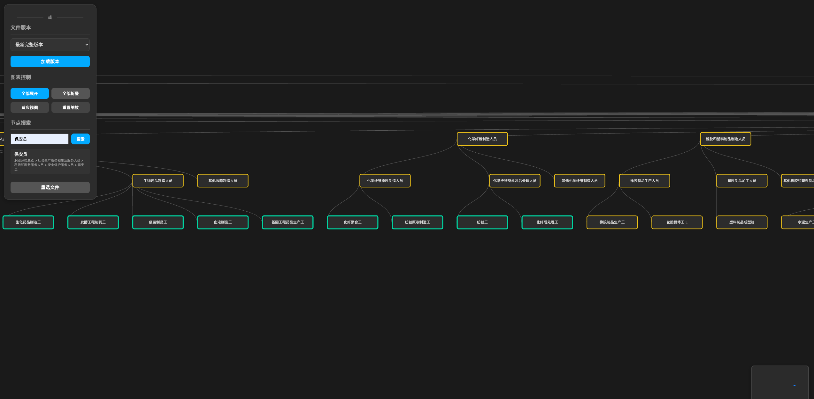

### 一键启动

```bash
# 使用部署脚本
KIMI_API_KEY=kimi_api_key_here ./docker/scripts/deploy.sh --env local --services all
```

**Web界面**: http://localhost:8080

### 界面预览

*职业分类数据的层级树形结构可视化，支持展开收缩和搜索功能*

### 解题分析

- **OCR 准确性不足**：传统 OCR 在识别复杂版式 PDF 时，无法准确保留文本的层级关系和字体信息
- **半结构化数据处理困难**：职业分类数据同时包含结构化（代码、层级）和非结构化（描述文本）信息
- **文本块关联错误**：OCR 经常将不相关的文本块错误关联，导致职业名称和代码匹配错误
- **缺少语义理解**：纯 OCR 无法区分职业名称和描述性文本，需要语义层面的理解
- **数据源不一致**：PDF 和 Excel 数据源存在差异，需要智能化的交叉验证

### 解决方案

- 保留 OCR 原始信息（坐标、字体、页码），为后续处理提供上下文
- 多源数据交叉验证，通过 Excel 和 PDF 互相纠错
- 规则引擎处理结构化部分，AI 处理非结构化部分
- 两阶段 LLM 清洗，逐步提升数据质量
- 页面快照保留原始版式，支持人工核验

**难点**：同层级职业名称混淆 同一小类下的职业名称语义相近，LLM 难以准确区分（如"镀层工"vs"涂装工"）

- 语义关联度都很高，难以自动判断
  **未来解决方向**：
- 引入向量化相似度计算
- 识别高相似度案例并标记
- 通过人工标注积累训练数据（Label Studio）
- 训练专门的细粒度分类模型（LayoutLLM）


